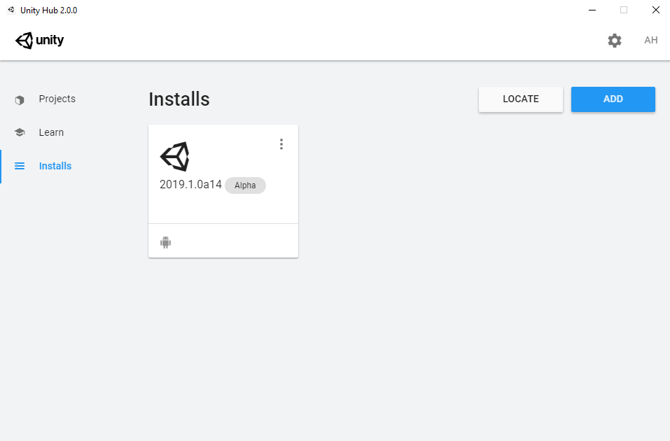
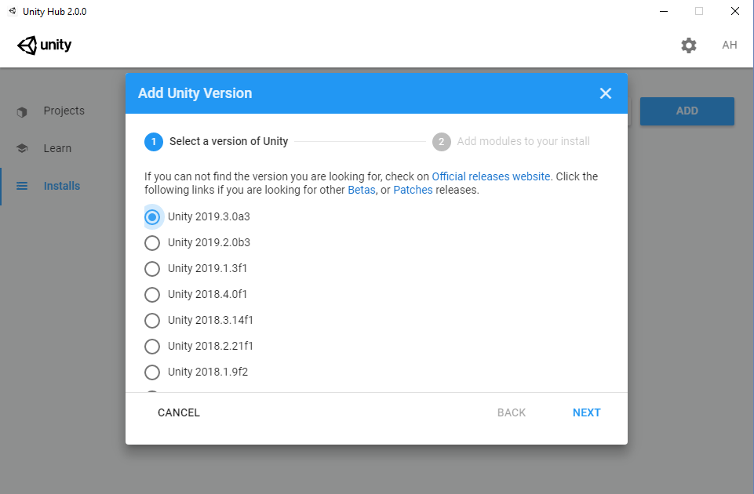
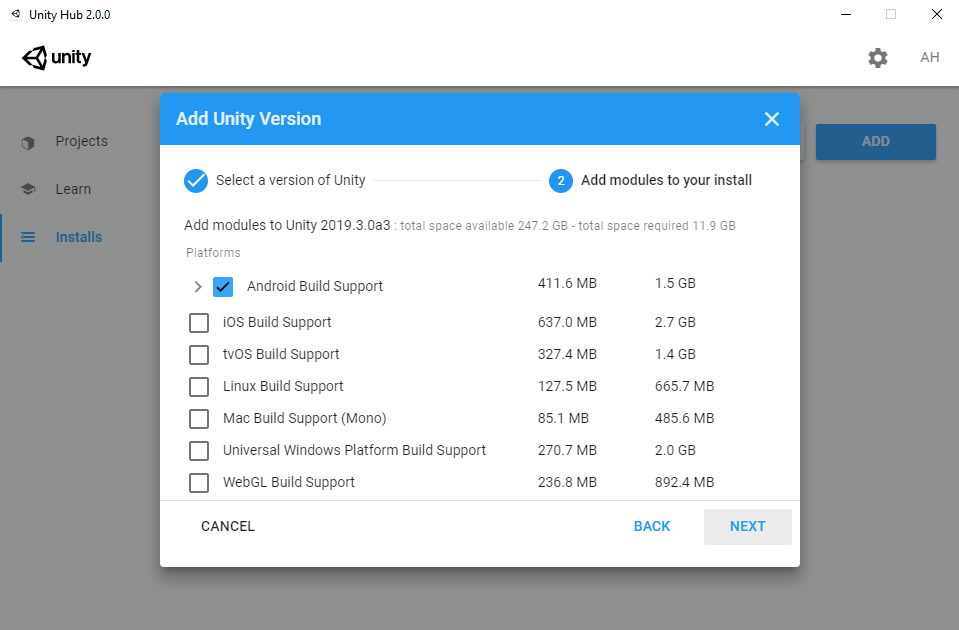
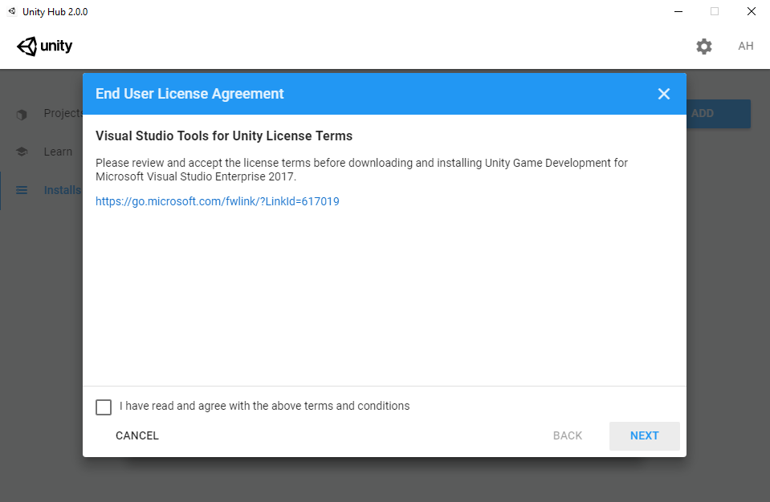
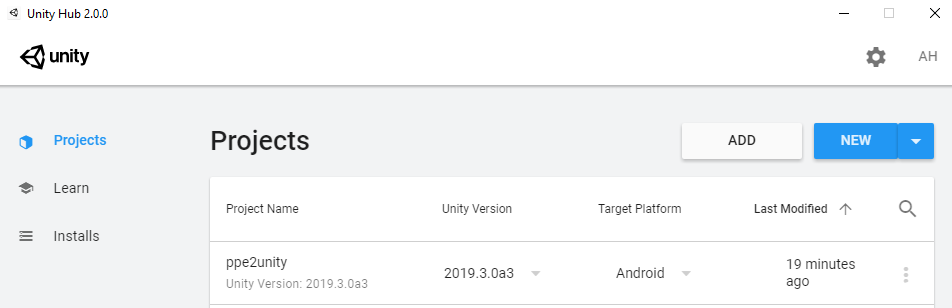
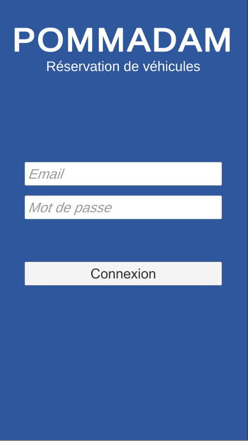
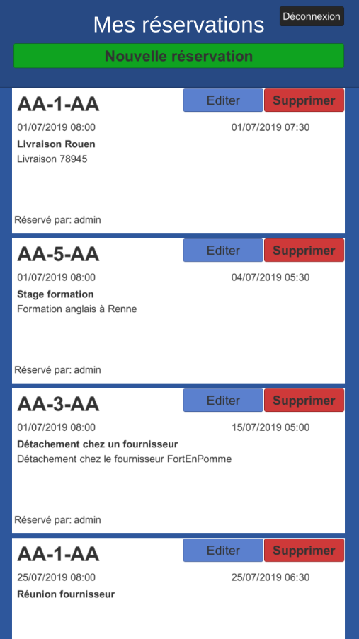
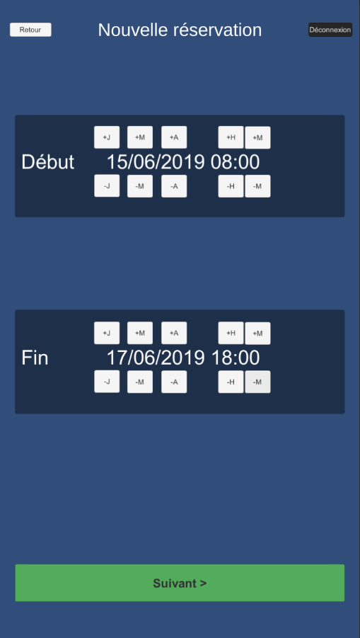
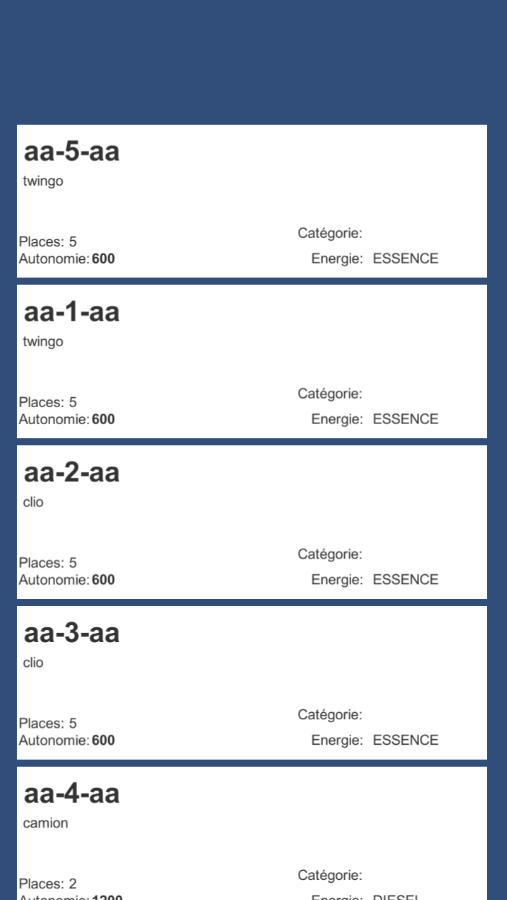
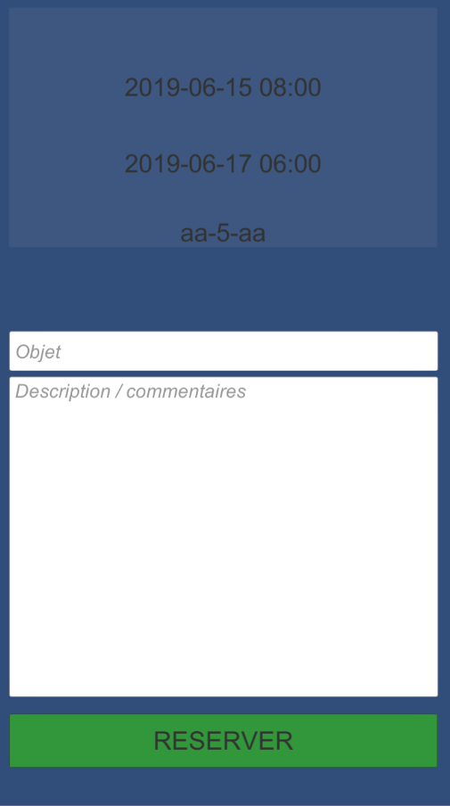

# **Application mobile du PPE2 - POMMADAM**
* Prérequis
* Mise en place
* Utilisation
* Documentation

## Prérequis
Sur Windows 10:
### GIT
* Télecharger [Le fichier d'installation](https://git-scm.com/download/win)
* Double cliquer dessus et suivre les étapes d'installations par défaut
### ANDROID STUDIO
* Télecharger [Le fichier d'installation](https://developer.android.com/studio)
* Double cliquer dessus et suivre les étapes d'installations par défaut

### UNITY
* Télecharger [le fichier d'installation d'Unity Hub](https://store.unity.com/fr/download?ref=personal)
* Double cliquer dessus et suivre les étapes d'installations par défaut
* Ouvrir Unity Hub
* Cliquer sur "Installs" puis sur "ADD"

* Selectionner la version 2019.3.X puis sur "NEXT"

* Ajouter le module "Android Build Support" et cliquer sur "NEXT"

* Accepter les licences (après les avoir lu! ;) ) et cliquer sur "NEXT"

## Mise en place
Ouvrir l'invité de commande dans le répertoire d'installation d'Unity (Par défaut `cd C:\Program Files\Unity`).

Cloner le dépot git en tapant la commande:

    git clone https://github.com/N4n3x/ppe2unity.git

Lancer Unity Hub, le projet "ppe2unity" doit apparaitre.
Cliquer dessus pour l'ouvrir.

## Utilisation
Une fois dans Unity, il est possible de tester le projet (`ctrl + p`) ou de compiler le projet.

Pour compiler et tester l'application sur un téléphone:
Sur le téléphone
* Activer le mode développeur du téléphone
    * Paramètres > A propos > Informations logicielles
    * toucher 7 fois "Numéro de build".
    * une popup confirme le déverrouillage du mode développeur.
* Dans le menu développeur du téléphone (Paramètres > Options pour les développeurs) activer le Débogage USB.
* Brancher le téléphone à l'ordinateur avec un cable USB et accepter l'avertissement.
Dans Unity
* `ctlr + b` pour lancer le "Build and run"
* Attendre la fin du build, l'application ce lancera automatiquement sur le téléphone une fois le build fini
### Connexion
Entre l'Email, le mot de passe et cliquer sur "Connexion"

### Réservation
* Cliquer sur "Nouvelle réservation" ou sur le boutton "Editer" d'une réservation existante

* Saisir l'heure de début et de fin de la réservation

* Selectionner le véhicule souhaité

* Renseigner l'objet et une dercription du trajet et cliquer sur "RESERVER"

## Documentation
[Lien vers la documentation](http://alexandrehernandez.fr/portfolio/documentations/ppe2/index.html)